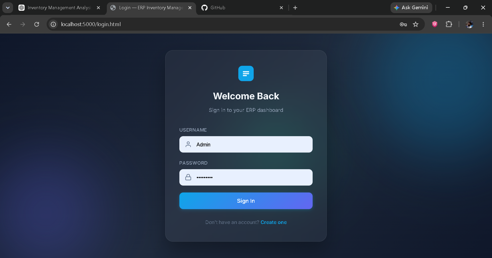
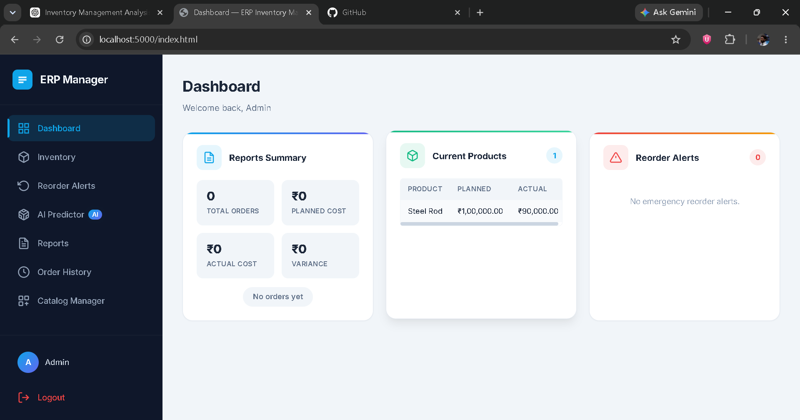
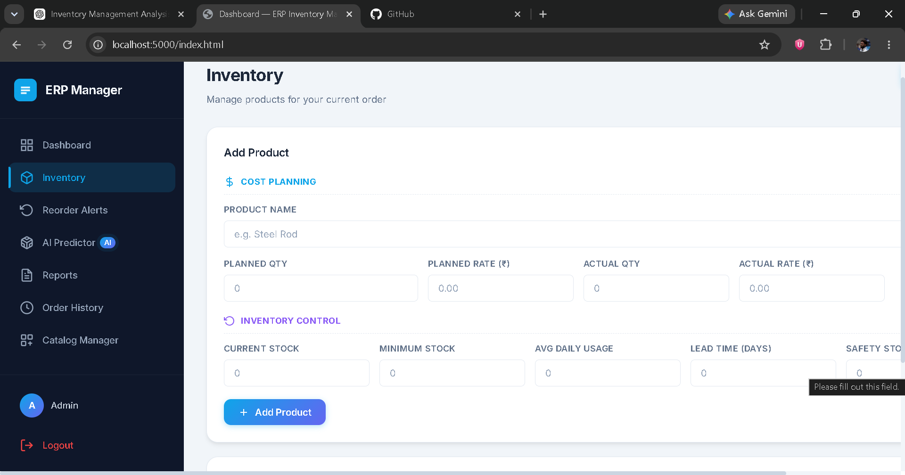
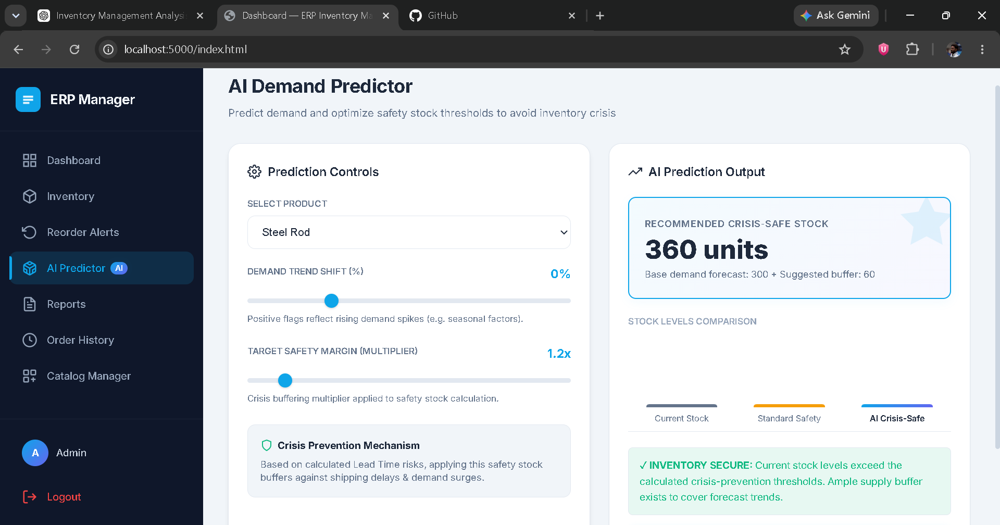

# ERP Inventory Management System

A full-stack ERP (Enterprise Resource Planning) Inventory & Procurement Management System developed using **Node.js, Express.js, MySQL, HTML, CSS, and JavaScript**.

This project was developed as part of my internship and demonstrates the implementation of a complete inventory management workflow with authentication, product management, supplier management, procurement features, and AI-assisted inventory recommendations.

---

## Features

### Authentication
- Secure Login & Registration
- JWT-based Authentication
- Password Encryption using bcrypt

### Inventory Management
- Add Products
- Update Products
- Delete Products
- Search Products
- Stock Tracking

### Supplier Management
- Add Suppliers
- Update Supplier Information
- Supplier Database

### Procurement
- Purchase Order Management
- Inventory Updates

### AI Inventory Prediction
- Safety Stock Recommendation
- Inventory Forecasting
- Smart Stock Level Suggestions

### Dashboard
- Inventory Overview
- Product Statistics
- System Health Monitoring

### Backend API
- RESTful API using Express.js
- MySQL Database Integration
- Environment Variable Configuration
- Error Handling Middleware

---

# Tech Stack

## Frontend
- HTML5
- CSS3
- JavaScript

## Backend
- Node.js
- Express.js

## Database
- MySQL

## Authentication
- JSON Web Tokens (JWT)
- bcrypt.js

## Additional Libraries
- dotenv
- cors
- morgan
- mysql2

---

# Project Structure

```
Inventory/
│
├── backend/
│   ├── config/
│   ├── controllers/
│   ├── middleware/
│   ├── routes/
│   ├── utils/
│   ├── database/
│   └── server.js
│
├── frontend/
│
├── package.json
├── .env
├── .gitignore
└── README.md
```

---

# Installation

## Clone Repository

```bash
git clone https://github.com/YOUR_USERNAME/erp-inventory-management-system.git
```

---

## Install Dependencies

```bash
npm install
```

---

## Create Environment File

Create a `.env` file in the project root.

Example:

```env
PORT=5000

DB_HOST=127.0.0.1
DB_USER=root
DB_PASSWORD=YOUR_PASSWORD
DB_NAME=erp_inventory
DB_PORT=3306

JWT_SECRET=your_secret_key
JWT_EXPIRES_IN=7d
```

---

## Create Database

```sql
CREATE DATABASE erp_inventory;
```

Import the SQL schema from:

```
backend/database/schema.sql
```

---

## Start the Server

```bash
npm start
```

The application will start on:

```
http://localhost:5000
```

---

# Screenshots

## Login Page



---

## Dashboard



---

## Inventory Management



---

## AI Stock Predictor



---

# Future Enhancements

- Barcode Scanner Integration
- QR Code Support
- Email Notifications
- Role-Based Access Control
- Sales Analytics Dashboard
- Cloud Deployment
- Mobile Responsive UI
- Predictive Demand Forecasting

---

# Learning Outcomes

This project helped me gain practical experience in:

- Full Stack Web Development
- REST API Development
- Express.js
- MySQL Database Design
- Authentication using JWT
- CRUD Operations
- Environment Configuration
- Database Connectivity
- Inventory Management Concepts

---

# Author

**Somesh H**

 BE Student

Project – ERP Inventory Management System

---

# License

This project is intended for educational and portfolio purposes.
